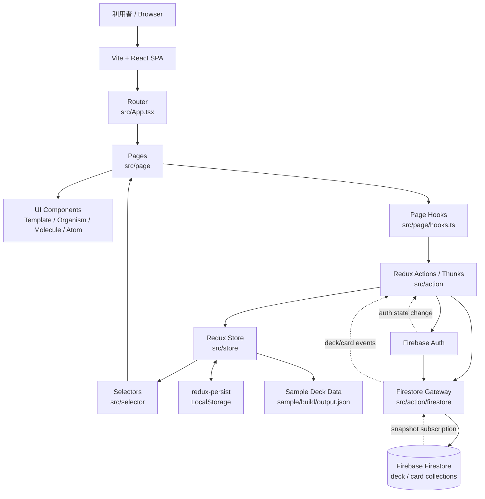

# Tango アーキテクチャ図

## 構成メモ

- `src/main.tsx` で Redux `Provider` と `PersistGate` を初期化します。
- `src/App.tsx` でルーティングし、各 `Page` が画面単位の振る舞いをまとめます。
- `src/page/hooks.ts` から Action を呼び、状態更新や画面遷移を行います。
- `src/store` と `src/selector` が画面状態の保持と参照を担当します。
- `src/action/firestore` が Firestore との入出力を担当し、`src/action/event.ts` が認証と購読開始を管理します。
- 初期状態には `sample/build/output.json` のサンプルカードが取り込まれます。
