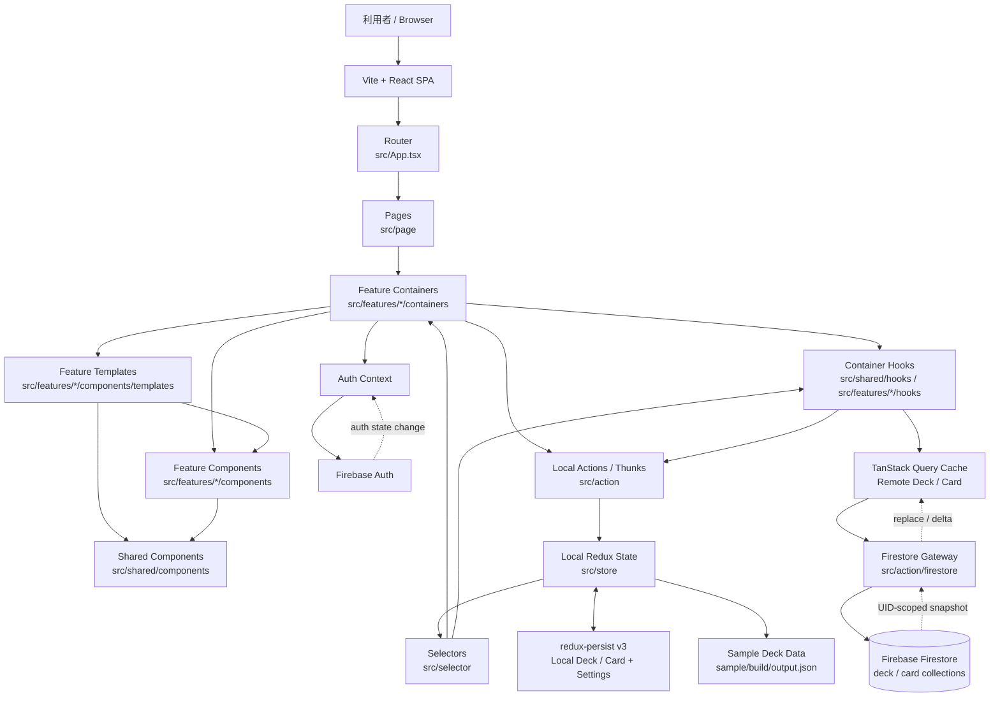

# Tango アーキテクチャ図

## UI の依存方向と state 所有

UI の依存方向は `App -> Page -> Container -> Template -> Component` です。`src/page` の各 route entry は対応する feature の container を 1 つ render します。

- `containers` は route と store のデータを取得し、画面の rendering を調整します。
- feature hook は再利用する feature 固有の form/UI state と、Redux・TanStack Query・router・Zustand などの接続や副作用をカプセル化します。
- `components/templates` は画面単位の stateless な合成を、`components` は props-driven な表示を担当します。domain/UI state を所有しない表示統合として、`Code` の DOM highlighting や `useSwipeable` などの render-only hook は利用できます。
- `src/shared/components` は feature に依存しない stateless な共通表示です。feature 間の調整は container が行います。
- feature 固有の container-support hook は `src/features/<feature>/hooks`、feature 間で共有する container hook は `src/shared/hooks` に置き、Page・Template・Component からは呼びません。

## Shared component の責務別 group

`src/shared/components` は component の大きさではなく責務で分類し、Atomic Design の atom/molecule taxonomy は使いません。

- `layout`: `FullScreen`、`Header`、`Layout`、`List`、`Main`、`Outer`
- `forms`: `Button`、`Form`、`FormItem`、`Input`、`Select`、`Slider`、`Switch`、`Tag`、`Textarea`、`Upload`
- `content`: `Card`、`Code`、`Description`、`Logo`、`Math`、`Score`、`Section`、`Style`、`TagList`、`Title`
- `feedback`: `Feedback`、`Overlay`

公開 API は root barrel の `@/shared/components` です。stories と component 固有の style は対象 component と同じ group に置き、各 group は feature 非依存かつ stateless に保ちます。

## Feature map

`src/features` は `deck`、`card`、`study`、`import`、`settings` に分かれます。stories と specs は対象の component、template、container と同じ feature に置きます。Storybook は `src/**/*.stories.tsx`、Vitest は `src/**/*.spec.{ts,tsx}` を discovery します。

## 構成メモ

- `src/main.tsx` で Redux、TanStack Query、Auth Context を初期化します。
- `src/App.tsx` は route と application bootstrap を担当します。
- `src/store` と `src/selector` は local-mode entity と長期設定だけを保持します。persist v3 migration は remote entity と旧認証情報を除去します。
- TanStack Query が Firestore由来の Deck / Card の唯一の cache です。UID変更・logout時は listener停止、query cancellation、UID cache削除を同期順序で行います。
- Firebase Auth の runtime identity は Auth Context だけから参照し、Redux / LocalStorage には保存しません。
- `src/action/firestore` が Firestore との入出力を、`src/auth/AuthBootstrap.tsx` が認証に連動した購読 lifecycle を担当します。
- 初期状態には `sample/build/output.json` のサンプルカードが取り込まれます。
