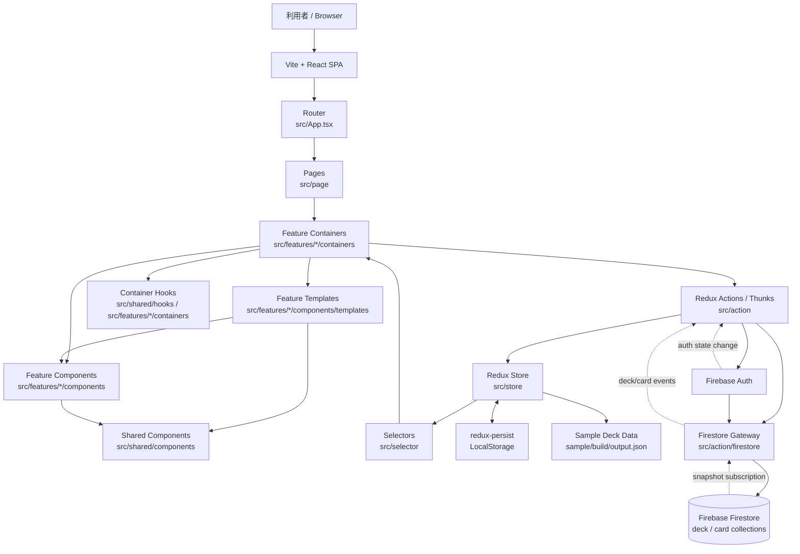

# Tango アーキテクチャ図

## UI の依存方向と state 所有

UI の依存方向は `App -> Page -> Container -> Template -> Component` です。`src/page` の各 route entry は対応する feature の container を 1 つ render します。

- `containers` は Redux、router、keyboard shortcut、form state、timer、overlay などの変更可能な state と副作用を所有します。
- `components/templates` は画面単位の stateless な合成を、`components` は props-driven な表示を担当します。
- `src/shared/components` は feature に依存しない共通表示です。feature 間の調整は container が行います。
- container 専用 hook は `src/shared/hooks` または feature の `containers` 配下に置き、Page・Template・Component からは呼びません。

## Feature map

`src/features` は `deck`、`card`、`study`、`import`、`settings` に分かれます。stories と specs は対象の component、template、container と同じ feature に置きます。Storybook は `src/**/*.stories.tsx`、Vitest は `src/**/*.spec.{ts,tsx}` を discovery します。

## 構成メモ

- `src/main.tsx` で Redux `Provider` と `PersistGate` を初期化します。
- `src/App.tsx` は route と application bootstrap を担当します。
- `src/store` と `src/selector` が画面状態の保持と参照を担当します。
- `src/action/firestore` が Firestore との入出力を担当し、`src/action/event.ts` が認証と購読開始を管理します。
- 初期状態には `sample/build/output.json` のサンプルカードが取り込まれます。
