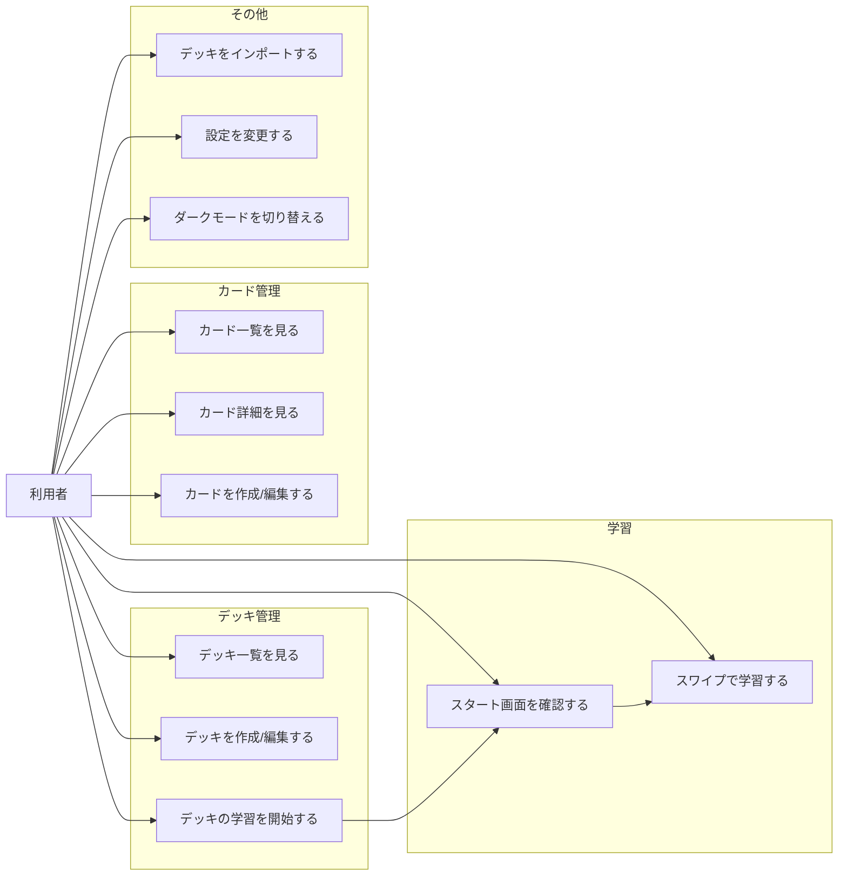

# 機能一覧

## 1. デッキ管理
- デッキ一覧の表示
- デッキ新規作成・編集
- デッキの学習開始

## 2. カード管理
- デッキ配下のカード一覧表示
- カード詳細の表示
- カード新規作成・編集

## 3. 学習
- スワイプUIでの学習（カード送り）
- 学習開始前のスタート画面

## 4. インポート
- デッキデータのインポート

## 5. 設定
- アプリ設定画面
- ダークモード切り替え

---

## ユースケース図（Mermaid）

