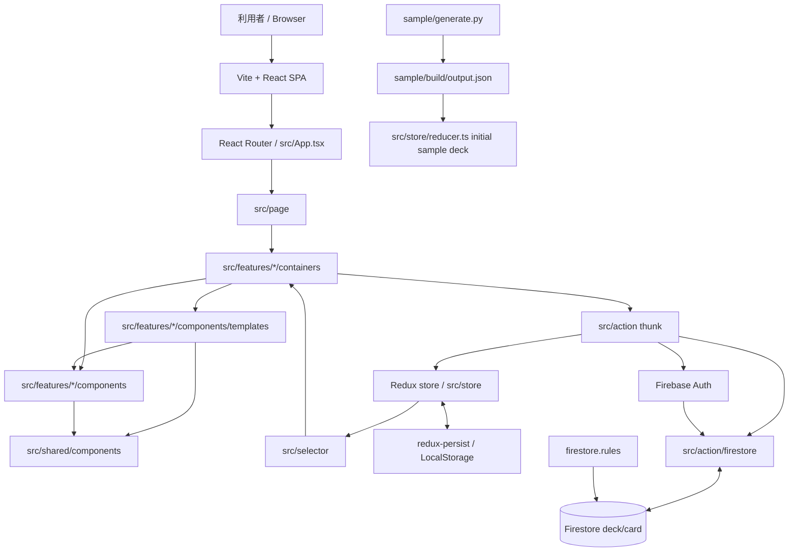
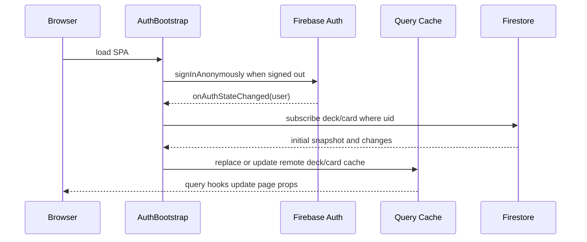
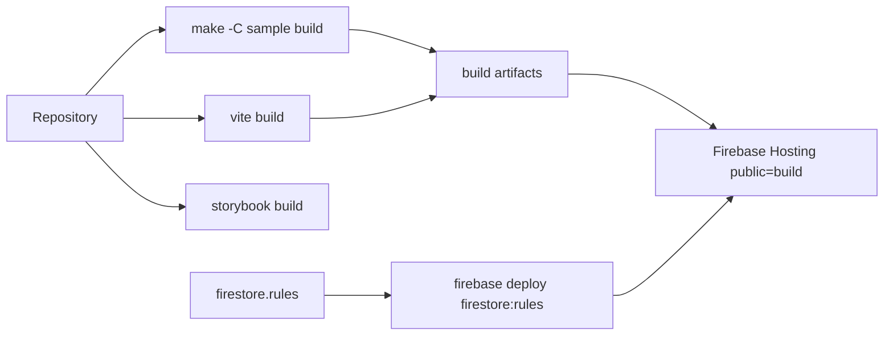

# Architecture

## System View

## Runtime Boundaries

- Browser 内で動く React SPA が中心です。server-side application code は見当たりません。
- Redux state は local-mode の `deck`、`card` と長期 `config` に分かれ、`redux-persist` で LocalStorage に保存されます。
- Firebase Auth は匿名ログインと Google ログインを扱います。
- Firestore には `deck` と `card` の collection があり、`src/action/firestore/event.ts` が uid 条件で snapshot を購読します。
- remote deck/card は TanStack Query cache、runtime identity は Auth Context だけで保持します。
- `localMode` が true の deck/card は Firestore に保存せず、Redux state のみで扱います。

## State And Data Flow

## Build And Deployment View

## Notable Design Choices

- UI は `App -> Page -> Container -> Template -> Component` の順に依存します。`src/page` は対応する feature container を 1 つ render するだけの route entry です。
- Redux、router、form、keyboard、timer、変更可能な UI state は `src/features/*/containers` が所有します。`components/templates` と `components` は props-driven な表示層です。
- `src/shared/components` は feature に依存せず、feature の presentation は同じ feature または shared の presentation だけを参照します。依存境界は `src/lib/componentArchitecture.spec.ts` が検証します。
- UI stories/specs は対象 component、template、container と同じ feature/shared 配下に置き、`src/**/*.stories.tsx` と `src/**/*.spec.{ts,tsx}` から discovery されます。
- domain 操作は `src/action` の thunk に集約されています。
- reducer は action type 文字列と `equal()` helper で分岐します。
- Firestore 書き込みの一部は UI 遷移遅延を避けるため `void firestore.xxx(...)` の fire-and-forget になっています。
- sample deck は Python サブプロジェクトで生成した JSON を build input として取り込みます。
