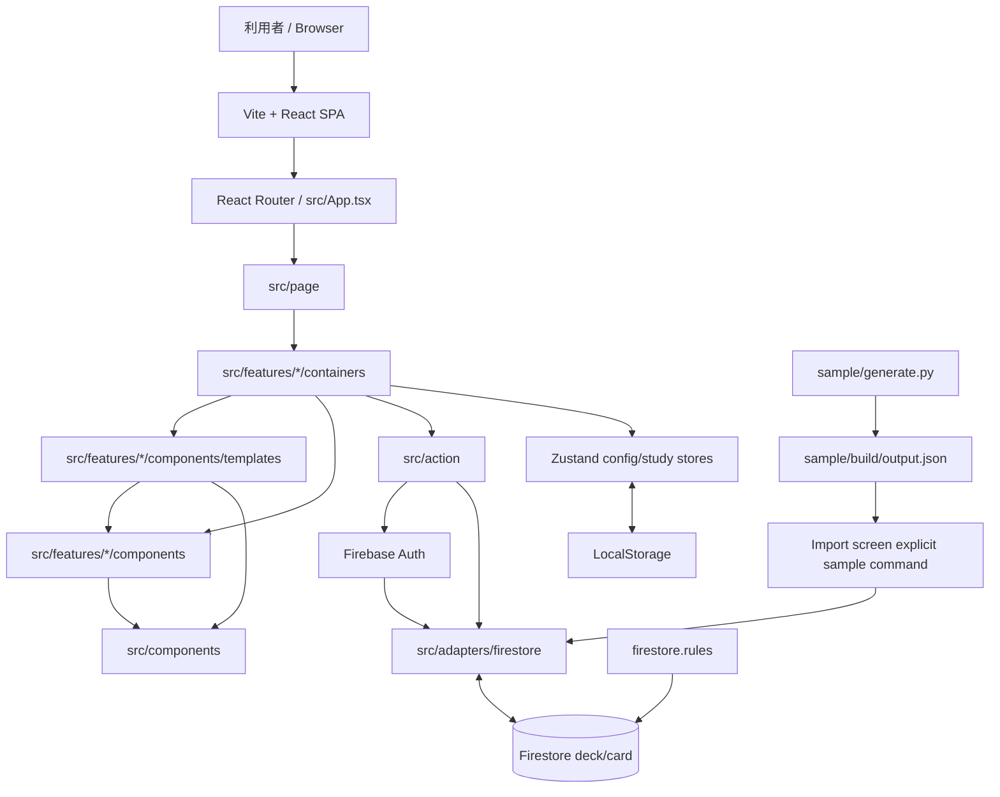
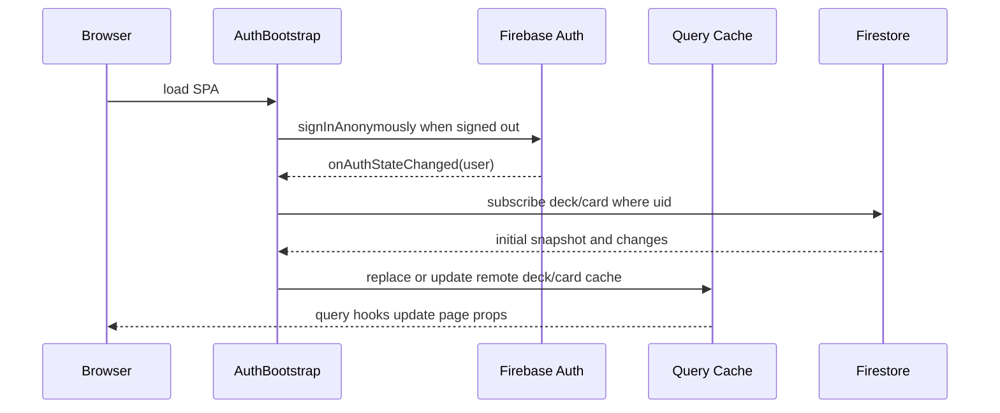
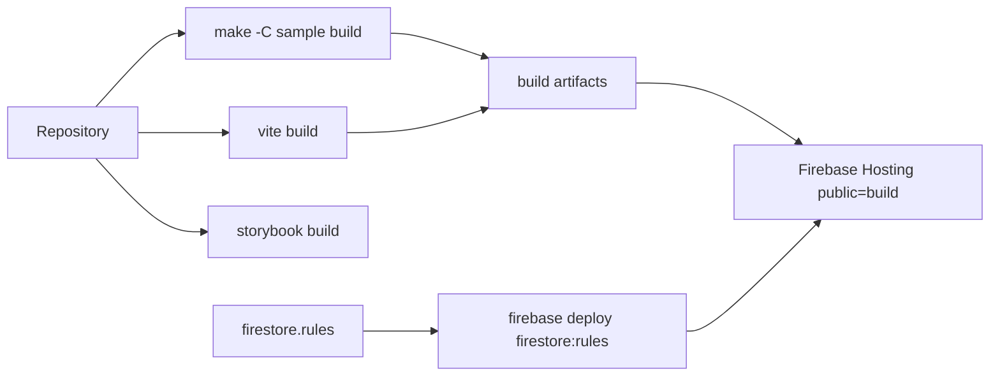

# Architecture

## System View

## Runtime Boundaries

- Browser 内で動く React SPA が中心です。server-side application code は見当たりません。
- Firebase Auth は匿名ログインと Google ログインを扱います。
- Firestore には `deck` と `card` の collection があり、`src/adapters/firestore/event.ts` が uid 条件で snapshot を購読します。
- Firestore SDK、document DTO、mapper、collection 名、Timestamp 変換、runtime 初期化は `src/adapters/firestore` に閉じます。Firebase 非依存の read contract は `src/query/remoteReadContract.ts` が所有します。
- deck/card は Firestore に保存し、Firestore SDK の persistent local cache で offline 利用に対応します。TanStack Query は application cache を担います。
- runtime identity は Auth Context、長期設定と学習セッションは Zustand で保持します。

## State And Data Flow

## Build And Deployment View

## Notable Design Choices

- UI は `App -> Page -> Container -> Template -> Component` の順に依存します。`src/page` は対応する feature container を 1 つ render するだけの route entry です。
- router、form、keyboard、timer、変更可能な UI state は `src/features/*/containers` と feature hook / Zustand store が所有します。`components/templates` と `components` は props-driven な表示層です。
- `src/components` は feature に依存せず、feature の presentation は同じ feature または共通 component だけを参照します。依存境界は `src/lib/componentArchitecture.spec.ts` が検証します。
- UI stories/specs は対象 component、template、container と同じ `components` または feature 配下に置き、`src/**/*.stories.tsx` と `src/**/*.spec.{ts,tsx}` から discovery されます。
- domain 操作は `src/action` と feature mutation hook に集約されています。
- Deck/Card mutation は TanStack Query cache を optimistic に更新し、Firestore 書き込みを待機して失敗時に rollback します。
- mutation service と remote read controller は既存の関数注入境界を使います。Repository interface や DI container は追加せず、concrete Firestore adapter は application composition module だけで配線します。
- sample deck は Python サブプロジェクトで生成した JSON を、Import 画面から通常の Firestore mutation で追加します。
