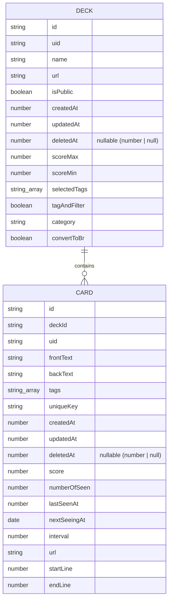

# ER Diagram

Firestore collection と TypeScript 型から確認できるデータ構造です。RDBMS の migration は見当たらないため、Firestore document model として整理しています。

## Collections

| Collection | Source | Notes |
| --- | --- | --- |
| `deck` | `src/action/firestore/deck.ts`, `src/vite-env.d.ts` | deck document を `deck.id` で保存します。`create()` は `createdAt` と `updatedAt` を現在時刻に更新します。 |
| `card` | `src/action/firestore/card.ts`, `src/vite-env.d.ts` | card document を `card.id` で保存します。`deckId` が deck への参照です。 |

## Relationship

- `Card.deckId` が `Deck.id` を参照します。
- `Deck.cardOrderIds` は学習順を保持する card id 配列です。
- Firestore rule では card create/update 時に `request.resource.data.deckId` の deck 所有者が `request.auth.uid` と一致することを確認します。

## Deletion Semantics

- `card.logicalRemove()` は `deletedAt` と `updatedAt` を設定する soft delete です。
- `deck.remove()` は該当 deck の card を query して削除し、deck document も `deleteDoc` します。
- snapshot 購読では `deletedAt != null` の document を removed event として扱います。

## Local State Only

`ConfigState` は Firestore collection ではなく Zustand store と LocalStorage の `tango-config` に保存されます。学習中の `currentIndex` と `cardOrderIds` は Zustand study store が所有し、deck document には保存しません。
