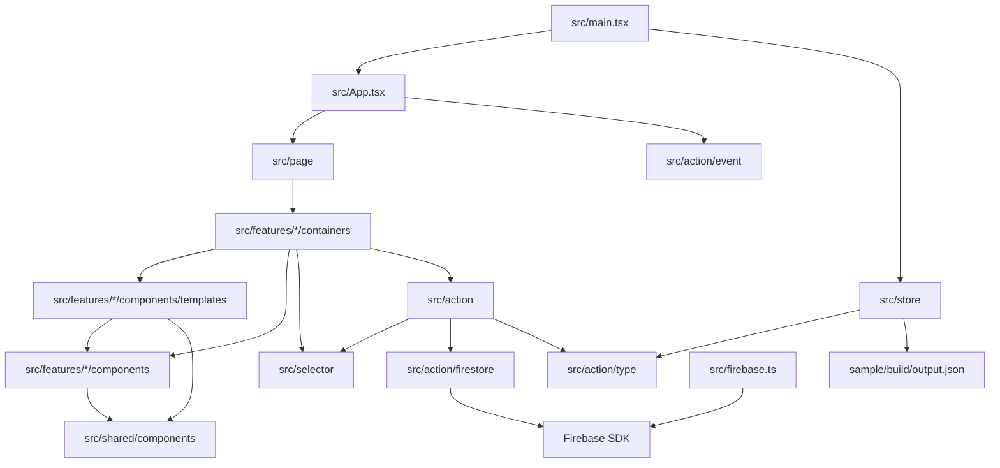

# Module Map

## Source Modules

| Module | Responsibility | Important Dependencies |
| --- | --- | --- |
| `src/main.tsx` | React root、Redux Provider、PersistGate の組み立て | `react-dom`, `react-redux`, `redux-persist`, `src/store` |
| `src/App.tsx` | dark mode class 管理、event init、route 定義 | `react-router-dom`, `src/page`, `src/action/event` |
| `src/page` | 対応する feature container を render する薄い route entry | `src/features/*/containers` |
| `src/features/*/containers` | Redux/router/form/UI state と副作用の接続 | `react-redux`, `react-router-dom`, `react-hook-form`, actions, selectors |
| `src/features/*/components/templates` | stateless な画面単位の UI 合成 | 同じ feature の components, `src/shared/components` |
| `src/features/*/components` | deck/card/config/study/import 固有の props-driven UI | `src/shared/components`, render 用 libraries |
| `src/shared/components` | button/input/layout/code/math など feature 非依存の共通 UI | Tailwind CSS, KaTeX, highlight.js, react-markdown |
| `src/shared/hooks` | 複数 feature の container で使う application hook | Redux, router, actions |
| `src/action` | thunk による domain 操作、CSV import/export、学習 swipe | `firebase`, `papaparse`, `file-saver`, selectors |
| `src/action/firestore` | Firestore CRUD と snapshot subscription | Firebase Firestore SDK |
| `src/store` | Redux reducer、initial sample deck、persist 設定 | `redux`, `redux-thunk`, `redux-persist`, `lodash` |
| `src/selector` | deck/card/config の derived state | `lodash`, `src/util` |
| `src/firebase.ts` | Firebase app 初期化と emulator 接続 | Firebase SDK |
| `sample` | sample card JSON 生成 | Python, click, pytest, ruff |

## Dependency Diagram

## Routing Map

| Path | Page | Primary Function |
| --- | --- | --- |
| `/` | `DeckListPage` | deck 一覧、学習開始、再開、download、edit、delete |
| `/deck/:id` | `CardListPage` | deck 内 card 一覧、filter、score swipe、card edit/delete、back text overlay |
| `/deck/:id/edit` | `DeckFormPage` | deck metadata 編集 |
| `/deck/:id/start` | `DeckStartPage` | 学習前 filter と start |
| `/deck/:id/study` | `DeckSwiperPage` | front/back text 表示、swipe、controller、自動送り |
| `/card/:id` | `CardViewPage` | card back text 表示 |
| `/card/:id/edit` | `CardFormPage` | card front/back/tags 編集 |
| `/settings` | `ConfigPage` | app 設定、Google login/logout、version 表示 |
| `/import` | `DeckImportPage` | CSV upload と sample CSV download |

## Package Boundaries

- この repository は `package.json` 上は single npm package です。
- `sample/` は独立した Python/Docker 構成を持つサブプロジェクトですが、生成物は React app の initial state に取り込まれます。
- Storybook は component/template と同じ feature または shared 配下の `src/**/*.stories.tsx` を読みます。Vitest の UI specs も対象 container/component と同じ module 配下に置きます。
