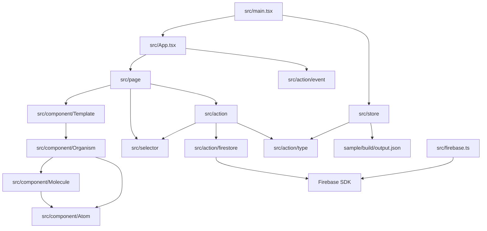

# Module Map

## Source Modules

| Module | Responsibility | Important Dependencies |
| --- | --- | --- |
| `src/main.tsx` | React root、Redux Provider、PersistGate の組み立て | `react-dom`, `react-redux`, `redux-persist`, `src/store` |
| `src/App.tsx` | dark mode class 管理、event init、route 定義 | `react-router-dom`, `src/page`, `src/action/event` |
| `src/page` | route container。selector と action hook を接続 | `react-redux`, `react-router-dom`, `src/selector`, `src/action` |
| `src/component/Template` | page から渡された props を使う画面 layout | Organism/Molecule/Atom |
| `src/component/Organism` | deck/card/config/study のまとまった UI と form | `react-hook-form`, `react-icons`, `react-swipeable` |
| `src/component/Molecule` | card/list/form/overlay/fullscreen などの中間 UI | Atom |
| `src/component/Atom` | button/input/textarea/slider/tag/code/math などの基本 UI | Tailwind CSS, KaTeX, highlight.js, react-markdown |
| `src/action` | thunk による domain 操作、CSV import/export、学習 swipe | `firebase`, `papaparse`, `file-saver`, selectors |
| `src/action/firestore` | Firestore CRUD と snapshot subscription | Firebase Firestore SDK |
| `src/store` | Redux reducer、initial sample deck、persist 設定 | `redux`, `redux-thunk`, `redux-persist`, `lodash` |
| `src/selector` | deck/card/config の derived state | `lodash`, `src/util` |
| `src/firebase.ts` | Firebase app 初期化と emulator 接続 | Firebase SDK |
| `sample` | sample card JSON 生成 | Python, click, pytest, ruff |

## Dependency Diagram

## Routing Map

| Path | Page | Primary Function |
| --- | --- | --- |
| `/` | `DeckListPage` | deck 一覧、学習開始、再開、download、edit、delete |
| `/deck/:id` | `CardListPage` | deck 内 card 一覧、filter、score swipe、card edit/delete、back text overlay |
| `/deck/:id/edit` | `DeckFormPage` | deck metadata 編集 |
| `/deck/:id/start` | `DeckStartPage` | 学習前 filter と start |
| `/deck/:id/study` | `DeckSwiperPage` | front/back text 表示、swipe、controller、自動送り |
| `/card/:id` | `CardViewPage` | card back text 表示 |
| `/card/:id/edit` | `CardFormPage` | card front/back/tags 編集 |
| `/settings` | `ConfigPage` | app 設定、Google login/logout、version 表示 |
| `/import` | `DeckImportPage` | CSV upload と sample CSV download |

## Package Boundaries

- この repository は `package.json` 上は single npm package です。
- `sample/` は独立した Python/Docker 構成を持つサブプロジェクトですが、生成物は React app の initial state に取り込まれます。
- Storybook は同じ React components を `src/**/*.stories.tsx` から読みます。
