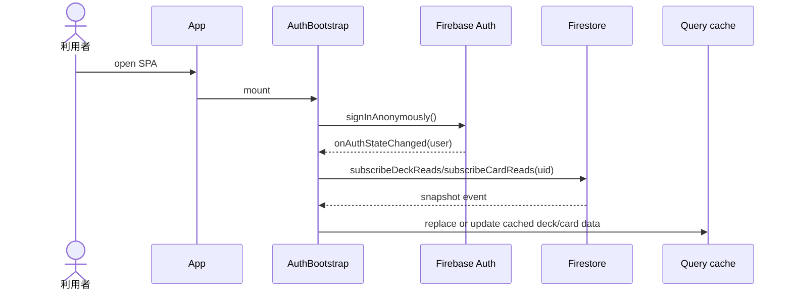
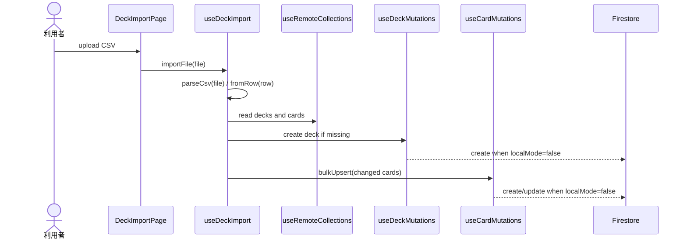
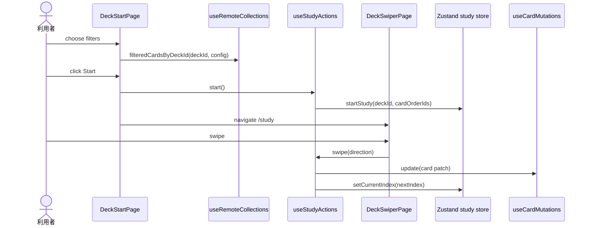
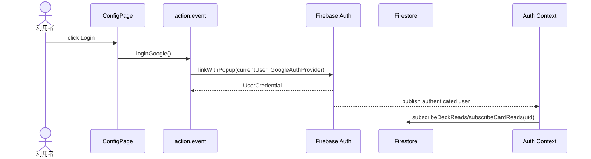

# Use Cases

## 1. アプリ起動と同期初期化

Actor: 利用者

1. 利用者が SPA を開きます。
2. `AuthBootstrap` が Firebase Auth の状態を監視します。
3. user がいない場合、Firebase anonymous sign-in を実行します。
4. auth state change で user 情報を Auth Context に公開します。
5. Firestore deck/card snapshot を購読し、Query cache に反映します。

## 2. CSV を import して deck/card を作る

Actor: 利用者

1. 利用者が `/import` で CSV file を選択します。
2. `useDeckImport` が `Papa.parse` で rows を読みます。
3. row は `card.fromRow()` で `frontText/backText/tags/uniqueKey` に変換されます。
4. `useRemoteCollections` から同名 deck と既存 card を取得します。
5. 同名 deck がない場合は deck mutation で作成します。
6. `uniqueKey` で新規・更新・変更なしを判定し、card mutation で一括反映します。

## 3. 学習を開始して swipe する

Actor: 利用者

1. 利用者が deck の Study を押して `/deck/:id/start` に移動します。
2. tag/score filter を調整します。
3. `useRemoteCollections` が filter 後の cards を返します。
4. Start を押すと `useStudyActions` が shuffle と max number を適用し、Zustand study store に `cardOrderIds` と `currentIndex` を保存します。
5. `/deck/:id/study` で front text を表示します。
6. swipe または arrow key で card mutation と current index を更新します。

## 4. Google login して Firestore 同期する

Actor: 利用者

1. 利用者が Settings で Login を押します。
2. 現在の anonymous user に Google provider を link します。
3. auth state change 後の user 情報を Auth Context に公開します。
4. uid を使って deck/card snapshot を購読します。

## 5. Deck を CSV として download する

Actor: 利用者

1. 利用者が deck card の download icon を押します。
2. `deck.download()` が deck 内 card を取得します。
3. `card.toRow()` で rows に変換します。
4. `Papa.unparse` で CSV 文字列にし、`file-saver` で保存します。
